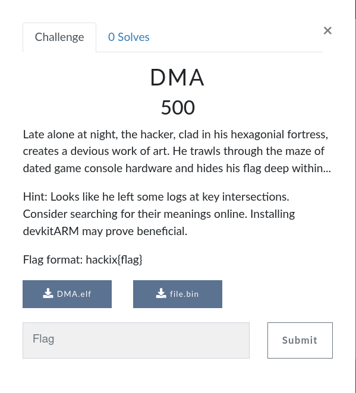
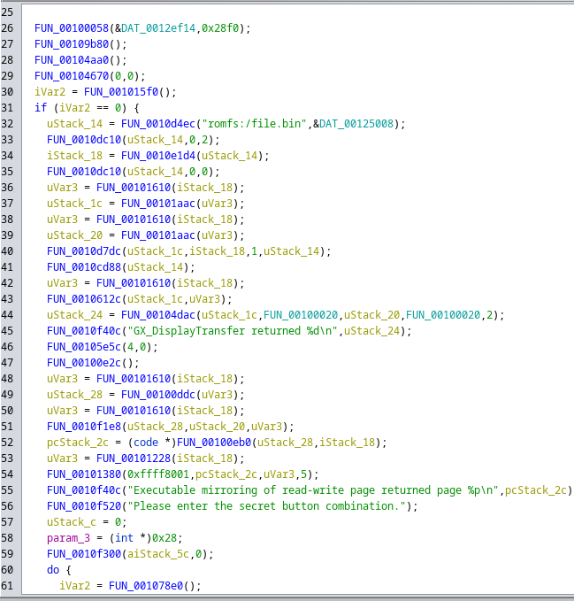
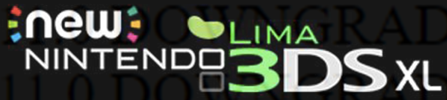
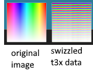
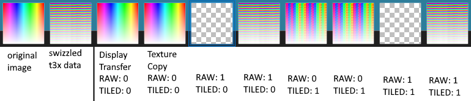

+++
title = "Making a CTF Challenge for the Nintendo 3DS"
template = "bootstrap-page.html"
authors = ["Swiftloke"]
date = 2023-04-02
[extras]
bootstrap = true
+++

Or, how to make your CTF challenge *much* harder than intended. This long-form article written by [Swiftloke](https://github.com/swiftloke/) describes an usual CTF challenge he wrote last year.
<!-- more -->
 

If you attended a certain hackathon late last year, you might have noticed a challenge listed like this:



You're given an ELF file and a mysterious "file.bin". What wonders lie within?

Apparently, it's a stripped 32-bit ARM binary. Let's open it up in our favorite decompiler and...



Oh my.

Come along with me as we partake in a journey to discover the flag hidden inside. Along the way I'll show you my thought process of the intended solution, and how a few rookie mistakes along the way made it significantly harder than intended to solve. While reading, keep in mind that this was intended to be a moderately difficult CTF challenge, maybe 6/10, with *one* interesting twist.

For those following along at home, you can download the challenge [here](Distributable_Challenge.zip).


## First Steps
Let's revisit those hints:

- Looks like he left some logs at key intersections... Installing devkitARM may prove beneficial.

The challenges target platform has already been spoiled by the title, but if one looked it up they'd find that devkitARM is a complete toolchain for Nintendo handheld consoles, including the GBA, DS, and 3DS. 

As for those logs... We can immediately see that "romfs:/file.bin" is an argument to a function. That means it's fopen, and that the return value is a file pointer... We'll come back to that shortly.

``GX_DisplayTransfer`` sounds like the name of the previous function. Plug that into our search engine and we get linked [directly to some documentation](https://libctru.devkitpro.org/gx_8h.html). Looks like the function is from libctru, which is the [user-mode library for writing useful homebrew on the 3DS](https://libctru.devkitpro.org/index.html). Now what's that function do...?

- Initiates a display transfer.

Well, that's not very helpful, but this is a "key intersection", so it's probably really important to understand this function.

The first major hurdle, and an unintended one, is that this functions utility isn't a mere search away. I spent quite a long time tinkering with 3DS homebrew, writing my own competent [2D renderer](https://github.com/Swiftloke/ModMoon/tree/master/source/sdraw) using the custom graphics API exposed with [citro3d](https://github.com/devkitPro/citro3d), so of course *I* know what ``GX_DisplayTransfer`` does, but it'll take some digging to discern its intentions for yourself. The average reverse engineer might find a few [examples](https://github.com/SVatG/SkateStation/blob/master/EffectCoolCube2.c#L176) online (I'm linking to one I found randomly), but they might not know to [search 3dbrew](https://www.3dbrew.org/wiki/GPU/External_Registers#Transfer_Engine), a knowledge base of 3DS reverse engineering, and then read between the lines to determine that this is a DMA copy function.

## DMA on the 3DS
Those familiar with computer architecture will know that a DMA engine is, in brief terms, an auxilliary device that can transfer large amounts of data without the CPUs involvement, freeing it up to perform more useful work. On the 3DS, the DMA engine is treated as part of the GPU, and is commonly used to upload textures to VRAM quickly. 

With that in mind, we can revisit the documentation and example, and this "key intersection" makes a little more sense. The code leading up to this block opens romfs:/file.bin, which we can safely assume is the same file.bin we were provided. We can see that a value is read out of the file object, passed into another function, then that value is passed into another function twice. The results of those functions are then the input and output addresses of the DMA transfer, implying that everything just mentioned was memory allocation. Let's make some changes to the decompiled function with that in mind...

{{ tabspills(tablist="reverse_start", lan="c", val=["a1","a2","a3","a4"], path=["/assets/code/3ds-ctf/reverse_start/1.c.md","/assets/code/3ds-ctf/reverse_start/2.c.md","/assets/code/3ds-ctf/reverse_start/3.c.md","/assets/code/3ds-ctf/reverse_start/4.c.md"]) }}
One noteworthy aspect of this, at least here, is that Ghidra mistakenly types the "dimension" flag of the display transfer as a function pointer. It's necessary to correct this issue; once it does, we can see that the dimension is composed of two 16-bit integers packed together as is seen in the documentation and example with the macro ``GX_BUFFER_DIM``. We need not worry too much about this, it's effectively a glorified size parameter with a display transfer. (As an aside, this parameter gets *much* more interesting with the GX_TextureCopy counterpart.) We also see a ``flags`` value of 2, which probably isn't important, right?


{{ embedcode(path="/assets/code/3ds-ctf/reverse_start/5.c.md") }}
## Executable mapping?
The next major failure creating this challenge was here. The other "key intersection" is a bit further down:

- Executable mirroring of read-write page returned page %p\n

I intended for this segment of the code to be *completely ignored*, because it's a lot of function calls towards something that's meant to be largely overlooked. However, I believe that this was not made clear enough. Another hint along the lines of ``Beginning to map DisplayTransfer result as executable...`` may have significantly improved the situation.

Here's what that block looks like in the source code:

```c
	ctrdl_initCodeAllocator();
	char* codeAlloc = ctrdl_allocateAligned(nextPow2(fsize));
	memcpy(codeAlloc, display_transfer_result, nextPow2(fsize));

	void* executable_addr = ctrdl_allocateCode(codeAlloc, fsize);

	ctrdl_changePermission(
            CUR_PROCESS_HANDLE, executable_addr,
            ctrdl_alignSize(fsize),
            MEMPERM_READEXECUTE);
	printf("Executable mirroring of read-write page returned page %p\n", executable_addr);
```

It's now time to explain what this does. The 3DS, like all contemporary operating systems, employs W^X (write or execute, but never both) memory protection, meaning that you can't execute a page that you've written to and vice versa. One can get around this using [Luma3DS](https://github.com/LumaTeam/Luma3DS), which relaxes enforcement of this policy; you can then have an allocated block of memory mapped as RW and a mirror of that memory mapped as RX. Ultimately, though, those technical details are unnecessary to understand what's important- this segment takes the result of the DMA operation and allows it to be executed.

|  |
|:--:|
| *It's Luma3DS, not Lima3DS.* |

It's important to remember while reading the rest of this article that *code is data*. For example, each single ARM instruction (add, subtract, multiply, compare, branch...) is a series of four bytes, decoded and executed by the processor. As [Wikipedia](https://en.wikipedia.org/wiki/Code_as_data) puts it:

- Code-as-data is also a principle of the Von Neumann architecture, since stored programs and data are both represented as bits in the same memory device. This architecture offers the ability to write self-modifying code. It also opens the security risk of disguising a malicious program as user data and then using an exploit to direct execution to the malicious program.

## The Main Loop
The main loop of the program is another subtle mistake, meant to be trivial to understand but in reality frustrating. 

{{ embedcode( path="/assets/code/3ds-ctf/reverse_main_loop/1.c.md") }}

One thing we are able to see is that somehow, if the loop exits correctly, ``local_5c`` must contain the output flag. But what's all the rest?

If I had only stated that ``FUN_0010810c`` was ``hidKeysDown()``, the 3DS function which gets the buttons that were just pressed, this would have instantly become clear as day. The main loop passes through the buttons pressed this frame, and somehow expects the executable code to spit out the flag if a certain button combination was pressed. Ghidra is actually mis-decompiling this code pointer call; the program does pass ``flag_buffer`` as a parameter, so I had to override the function signature to produce the correct output.

{{ tabspills(tablist="reverse_main_loop", lan="c", val=["a1","a2"], path=["/assets/code/3ds-ctf/reverse_main_loop/2.c.md","/assets/code/3ds-ctf/reverse_main_loop/3.c.md"]) }}


Let's review what we've learned so far:
- The program opened ``file.bin`` and loaded it into memory.
- It copied it with ``GX_DisplayTransfer`` via the DMA hardware.
- It mapped it as executable.
- It then executed the file and expected it to spit the flag out after pressing some sort of button combination.

*So our flag is inside executable code in ``file.bin``!* Let's disassemble that file...

{{ small(path="/assets/code/3ds-ctf/Reverse_Deobfuscated_Code_File/obfuscated.s.md") }}

Aw, nuts.

It couldn't be that easy, right? After the accidentally substantial reverse engineering effort, we're confronted with a bizarre puzzle. Somewhere along the line, this apparently executable code was transformed from gibberish into properly functioning code that will spit out our flag.

## Intermission- An Accidental Odyssey
This challenge was designed to have almost all of the information above available to you from the beginning. You were intended to learn that the file was opened, read in, fed to ``GX_DisplayTransfer`` (you were still intended to learn the meaning of that function on your own) and finally mapped as executable and run. Instead, it took careful, painful reverse engineering, with a lot of insight and guesswork. What went wrong?

The problem was that this challenge stripped *symbols* from the binary, the strings that identify the meanings of a function. While designing this challenge, I was running up against the deadline to the CTF and needed a way to prevent the challenge from simply being run on a real 3DS. After all, since the code is clearly valid by the time it's executed, one could simply attach a debugger to the running process and dump the code at that time.

Without any better ideas, I provided a stripped .ELF file as the binary. Without symbols, the devkitARM toolchain can't build it into an executable image. One of the more saavy people who attempted this challenge made many attempts to get it to run without progress; I figure at that rate, anyone who did manage to execute it deserves their flag... But at what cost? Recall that this was meant to be a "6/10" challenge, *run as a side event during a hackathon*, with one neat twist to discover; instead, it required a mountain of reverse engineering to even get far enough to discover the twist. Only one person got far enough to even consider uncovering the secret, and only long after the CTF had ended when they continued grinding away at it.

## This One Weird Trick Will Scramble Your Data At The Hardware Level!
With my lament about accidentally creating a CTF challenge raised from hell, let's come back to how that nonsense code gets transformed into being executable.

Let's review the process of how the data flows:
- Opened and read using the standard library functions.
- Copied using the GPUs DMA function.
- Mapped as executable using a library that I didn't write.

Where does that magical transformation happen?

No, seriously, engage your brain. Use some reading comprehension.

Perhaps the name of the challenge would help guide the way?

...

If you guessed "It's the DMA function", congratulations! You've been paying attention. If you skipped straight to the answer, well, I get it.

The PICA200 GPU in the 3DS employs swizzling, or tiling, in its texturing pipeline. This is fairly confusing terminology, as both of these phrases have multiple other uses in the realm of graphics (see vertex swizzling, i.e. ``vertex.xyz = vertex.zxy`` and tile-based rendering, a [type of GPU design well-suited to low-power environments](https://interactive.arm.com/story/the-arm-manga-guide-to-the-mali-gpu/)). In this context, swizzling means that texture memory is physically stored differently than would appear logical to the human eye. This is done for the purposes of spatial locality- if you re-arrange the data, you're able increase your cache hit rate and therefore make fewer (and costlier) trips to main memory.



So what does this have to do with a DMA transfer? Well, earlier it was stated that

- We also see a ``flags`` value of 2, which probably isn't important, right?

Maybe it is important. Let's check that documentation a little more closely... We can see a [list of transfer flags](https://libctru.devkitpro.org/gx_8h.html#a19b4c4ad91299256a7c285e9ba7673b9) here (which you'd be able to understand were transfer flags by looking at [the example](https://github.com/SVatG/SkateStation/blob/2818789c6d060a0144bb23af8de997d2ed9106b5/source/Tools.h#L54)). That ``GX_TRANSFER_OUT_TILED(x)`` flag is in fact referring to the very same form of tiling! The DMA engine on the 3DS has some functionality that allows it to, during the copy process, re-arrange data that is laid out in the way one expects into the way the GPU expects it. This can be used to load textures at runtime; think ports of games in which ahead-of-time translation isn't possible, or very bad code which decodes and loads PNG files at runtime instead of AoT conversion. (The latter was the de-facto standard while writing 3DS homebrew for a few years before the [tex3ds](https://github.com/devkitPro/tex3ds) project came out.) 

``GX_TRANSFER_OUT_TILED(1)`` is equal to ``(1<<1)`` which is equal to 2. So that means that this DMA transfer is applying that tiling flag, and the bytes are re-arranged to fit the tiled format. That's how this data winds up being real code instead of garbage!

At this point, there are two solutions to the problem. You'll need to tile this data to get the normal code back out. You can either:
- Treat the tiling system as a black box, or
- Understand how the tiling function works

I'll go over both solutions, as well as some trivia about how the tiling system works that made development a *lot* easier.

### Understand how the tiling function works
The PICA200 follows the common [Morton Order](https://en.wikipedia.org/wiki/Z-order_curve) tiling curve, also known as Z-Curve. As aforementioned, the goal of tiling is to increase *spatial locality* of texture accesses by re-arranging blocks. Morton Order is not particularly intuitive to me, and in fact I had little knowledge of it before writing this article; understanding that the 3DS has swizzling hardware without comprehending its inner workings was enough to write the challenge. I'll leave the Wikipedia link for those who seek to learn the idea for themselves, as they do a better job explaining it than I could.

### Treat the tiling system as a black box
This approach effectively means that you'll rewrite the challenge yourself, compile it, and execute it, either on real 3DS hardware or on an emulator. Luckily, you don't need to actually execute the code, you just need to dump it; that'll save you some headache.

Let's find another, more concise example of how display transfers work. I'm going to dig up an ancient piece of history which inspired this challenge in the first place- the aforementioned piece of code that would decode and tile PNG files at runtime. This was copied around the internet many, many times over the course of 2016 through 2018 (when [citro2d](https://citro2d.devkitpro.org/) and tex3ds were released, superseding it). I too used this code, and [we can see it in an early branch of my renderer project](https://github.com/Swiftloke/ModMoon/blob/bc32168ac060cca96ca45f075becce5118d1ba5f/source/sdraw.cpp#L92). 

**If you are interested in writing homebrew, do not use this code! It's dead for a reason! We have citro2d and tex3ds which do the same thing but faster and easier! See [the current examples](https://github.com/devkitPro/3ds-examples/blob/master/graphics/gpu/gpusprites/source/main.c) for a modern lesson!**

As you can see, it's fairly straightforward; one needs to allocate enough memory using ``linearAlloc`` (a block of memory that's guaranteed to be readable by the GPU) first, then shove your data into it. Flush the cache so the GPU can read your data, then initiate the transfer and wait for the GPU to signal that it's done. (``C3D_SafeDisplayTransfer`` is a citro3d function that allows usage of display transfers within a fully initialized C3D environment, such that the two don't trip over each other.) What's more important are the ``TEXTURE_TRANSFER_FLAGS``:

```c
// Used to convert textures to 3DS tiled format
// Note: vertical flip flag set so 0,0 is top left of texture
#define TEXTURE_TRANSFER_FLAGS \
	(GX_TRANSFER_FLIP_VERT(1) | GX_TRANSFER_OUT_TILED(1) | GX_TRANSFER_RAW_COPY(0) | \
	GX_TRANSFER_IN_FORMAT(GX_TRANSFER_FMT_RGBA8) | GX_TRANSFER_OUT_FORMAT(GX_TRANSFER_FMT_RGBA8) | \
	GX_TRANSFER_SCALING(GX_TRANSFER_SCALE_NO))
```

In this code, the vertical flip flag is set to enable a texturing convention; obviously don't do this, but do use the tiling flag.

With a little bit of elbow grease, and an installation of devkitARM as the challenge description recommends, you can use this tutorial to dump the original code.

### Aside: How to un-swizzle data
Writing this challenge requiring that I convert the code using the inverse of the swizzling function first, since F(F'(x)) = x. I started out by attempting to use tex3ds' [inverse swizzler](https://github.com/devkitPro/tex3ds/blob/master/source/swizzle.cpp#L28), but I couldn't get it quite right. While bashing my head against the wall, I inadventently nerd-sniped [DeltaV](https://github.com/LiquidFenrir) into performing a detailed, graphical series of tests on the GPU to see how flags affected the display transfer engine, and the results were quite interesting... 



This image showcases the results of the outputs of each combination of flags with ``GX_DisplayTransfer`` and its close cousin ``GX_TextureCopy`` (which is another DMA function for slightly different purposes.) Input into each is a swizzled texture, now let's take a look right-to-left at the results...

- Raw and tiled: Spits out the output with texture copy, hardware freeze with display transfer. (You're supposed to use texture copy for non-transformative DMAs.) 
- Not raw and tiled: Tiles the output. This makes a double-tile from the input.
- Raw and not tiled: Same results as raw and tiled.
- Not raw and not tiled: **The original image is returned.**

That's right, in addition to supporting tiling, the 3DS hardware supports **inverse tiling**! This is implemented to make final output to a framebuffer easy. Thus, scrambling the challenge code was as simple as changing a one to a zero and dumping the results to a file.

## Climbing the Summit
The reverse engineering nightmare overcome, the inscrutable DMA function understood and the obfuscated code un-scrambled, now at last the end is in sight...
{{ embedcode(path="/assets/code/3ds-ctf/Reverse_Deobfuscated_Code_File/1.c.md") }}


Well, this is really not that complicated... ``param_2`` is obviously a state which is stored by the calling function, we've already established that ``param_1`` is ``hidKeysDown()`` and ``param_3`` is the output flag. Let's update with that...

{{ embedcode(path="/assets/code/3ds-ctf/Reverse_Deobfuscated_Code_File/2.c.md" )}}

So that ``state`` value seems to rely on the current button inputs. If you click the correct sequence of buttons, it'll spit out the flag. If you went really far and [checked the bitmask of each button](https://libctru.devkitpro.org/hid_8h.html#a2f80701c36e79c0640d91c788feee0b3aa7b3a3d0503a46bec51c6e3da95747cc), you'd find that the function is actually searching for the Konami Code...

Anyway, let's move on to that flag. If the Konami Code is successfully input, the function will write some interesting values into the output buffer and then XOR those values with a constant (which is, as an Easter Egg, the [Quake inverse square root constant](https://en.wikipedia.org/wiki/Fast_inverse_square_root)) and spit that out. Do that XOR yourself and you'll have the flag.

## A last-minute disaster
Having spent two Saturdays building this challenge, the morning before the CTF was set to start I got a message from a colleague:

```
Them:

Oh shit
What's the flag
Bruh is it $THE_FLAG
I just did ``strings file.bin``

Me:

Is my challenge actually that broken
Yes that's the flag
```

And sure enough:
```bash
$ strings file.bin
l1ng_1s_
fUn!}
hackD
xi{SwiZz
```

This is how I learned not to leave your strings in plaintext. All of this incredibly complicated obfuscation couldn't stop people from discovering the flag, as four-byte segments had to still be present in the obfuscated file. I quickly added the XORing function and spent the next hour rebuilding the challenge (it shouldn't be too surprising that it's a *major* pain in the neck to build).

## Conclusion
Although not my first CTF challenge to be widely distributed, this was by far my most ambitious, and it shows along the way with the stacking mistakes making it inaccessible to all but the most talented reverse engineers. This was also my first long-form article since 2016, in which I wrote about some concepts of 3DS security without having formed a grasp on programming.

Reflecting on the value of writing, it's interesting that in terms of pure time investment writing this article probably took me about as long as making the challenge in the first place. Grabbing citations, checking notes, reverse engineering the challenge myself and making diagrams... It's tough work, but by doing it I get to share everything I learned.

If you've made it to the end of this article, I applaud your interest (or possible insanity). There will be more articles to come soon on some challenges I wrote earlier in 2022. In order to whet your appetite, I'll share the following teaser:

